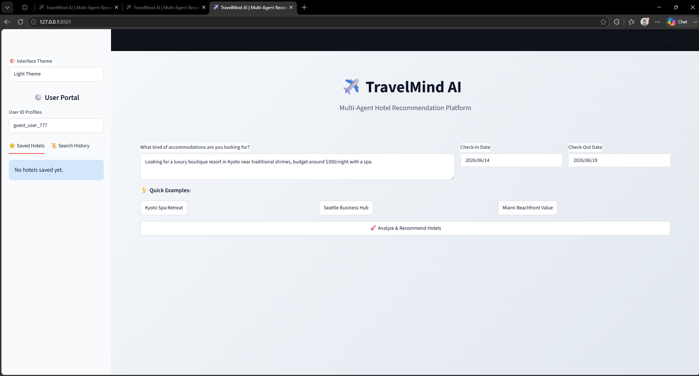
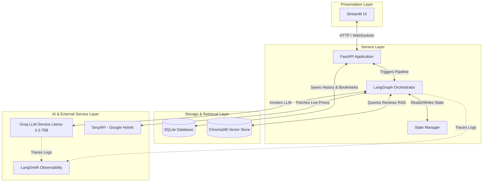
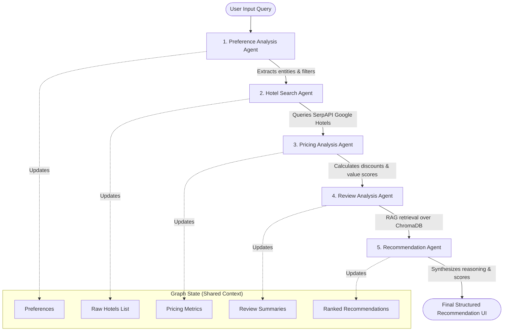

# ✈️ TravelMind AI: Multi-Agent Hotel Recommendation Platform

[](https://fastapi.tiangolo.com)
[](https://streamlit.io)
[](https://langchain.com)
[](https://langchain-ai.github.io/langgraph/)
[](https://www.sqlite.org)
[](https://www.docker.com)
[](https://groq.com)
[](https://meta.com)

**TravelMind AI** is a production-grade, Agentic AI-powered hotel recommendation system. It leverages multiple specialized AI agents orchestrated via **LangGraph** to deliver deeply personalized, data-driven, and context-aware accommodation recommendations. By combining real-time search, semantic review analysis (via RAG), dynamic pricing evaluation, and preference profiling, TravelMind AI redefines how travelers discover their next stay.

---

## 🖥️ Application UI Preview



---

## 📌 Table of Contents

* [📖 Problem Statement & Solution](#-problem-statement--solution)
* [🏗️ System Architecture](#%EF%B8%8F-system-architecture)
* [🔄 Multi-Agent Workflow](#-multi-agent-workflow)
* [🤖 Meet the Agents](#-meet-the-agents)
* [✨ Key Features](#-key-features)
* [📂 Project Directory Structure](#-project-directory-structure)
* [⚙️ Environment Variables Setup](#%EF%B8%8F-environment-variables-setup)
* [🚀 Getting Started (Local Development)](#-getting-started-local-development)
* [🐳 Docker Deployment](#-docker-deployment)
* [🔌 API Reference](#-api-reference)
* [🎯 Portfolio & Learning Outcomes](#-portfolio--learning-outcomes)
* [🔮 Future Roadmap](#-future-roadmap)
* [🤝 Contributing](#-contributing)
* [📄 License](#-license)

---

## 📖 Problem Statement & Solution

### The Problem
Traditional hotel booking platforms overwhelm users with thousands of listings, leaving them to manually sift through hundreds of mixed reviews, compare inconsistent pricing patterns, and filter amenities. Existing search systems lack **semantic understanding** and **personalized reasoning**—they treat a query for a *"quiet boutique hotel close to coffee shops suitable for writing"* the same as a search for *"hotels in Seattle"*.

### The Solution
**TravelMind AI** addresses this by modeling the hotel search experience as a cooperative **Multi-Agent workflow**. Users communicate their goals in natural language. The platform dynamically extracts preferences, executes live queries against Google Hotels, fetches and conducts semantic analysis over thousands of real guest reviews using Retrieval-Augmented Generation (RAG), monitors pricing trends, and produces a scored, highly customized recommendation report with structured reasoning.

---

## 🏗️ System Architecture

The following diagram illustrates how the frontend UI, backend API, agent orchestrator, external APIs, databases, and monitoring interfaces interact.



---

## 🔄 Multi-Agent Workflow

Our system models the agentic network using **LangGraph** as a directed graph where state transitions are controlled dynamically.



---

## 🤖 Meet the Agents

The system divides responsibilities among five micro-agents:

| Agent Name | Primary Responsibility | Input Specs | Output Specs |
| :--- | :--- | :--- | :--- |
| **Preference Analysis Agent** | Parse unstructured query, identify user intent, determine budget tier, requested amenities, location, and travel style. | Raw user prompt | Structured JSON (destination, budget range, amenities list, trip type) |
| **Hotel Search Agent** | Dynamically query the Google Hotels engine via SerpAPI using location and date parameters. | Cleaned location & search parameters | Array of candidate hotels with locations, ratings, and raw pricing |
| **Pricing Analysis Agent** | Analyze price distributions, flag value-deals, compare with average city-rates, and highlight savings. | Candidate hotels, original budget constraint | Pricing metrics, discounted flags, relative value score (1-10) |
| **Review Analysis Agent** | Retrieve semantic review snippets from ChromaDB matching target hotel and guest sentiments. | Filtered hotel list | Aggregated review pros/cons, sentiment score, specific highlights |
| **Recommendation Agent** | Generate the final personalized report, scoring each hotel based on preference fit, and supply clear reasoning. | All collected state data | Final ranked list, compatibility score, curated reasoning text |

---

## ✨ Key Features

- **🧠 Multi-Agent Orchestration**: Powered by LangGraph to maintain context, handle state transitions, and recovery cycles between agents.
- **🔍 Real-Time Hotel Search**: Integrates with SerpAPI to pull live inventory, availability, and pricing from Google Hotels.
- **🔗 Direct Booking Integration**: Automatically resolves and displays booking/detail links for recommended hotels, keeping links persistent in database bookmarks.
- **📚 Semantic Review Intelligence (RAG)**: Uses local vector database ChromaDB and `all-MiniLM-L6-v2` embeddings to perform semantic search on hotel reviews to uncover genuine customer sentiments.
- **💰 Smart Pricing Analysis**: Auto-calculates average market price for destinations and ranks listings by their value-for-money index.
- **📊 Interactive UI**: Streamlit dashboard featuring intuitive search history tracking, comparative visual charts, and saved hotel bookmarks.
- **🛠️ Production Observability**: Full execution trace integration via LangSmith to inspect tokens, agent latency, and graph traversal.

---

## 📂 Project Directory Structure

```
travelmind-ai/
├── assets/
│   └── app_screenshot.png       # Application UI screenshot for documentation
├── backend/
│   ├── app/
│   │   ├── __init__.py
│   │   ├── main.py              # FastAPI main entry point
│   │   ├── config.py            # Environment configurations & loading
│   │   ├── database.py          # SQLAlchemy SQLite configuration and schemas
│   │   ├── agents/              # LangGraph Agent logic
│   │   │   ├── __init__.py
│   │   │   ├── graph.py         # Graph construction and compilation
│   │   │   ├── state.py         # Shared agent State schema
│   │   │   ├── preference.py    # Preference Analysis Agent execution
│   │   │   ├── search.py        # Hotel Search Agent integration
│   │   │   ├── pricing.py       # Pricing Analysis Agent logic
│   │   │   ├── review.py        # RAG-based Review Analysis Agent
│   │   │   └── recommend.py     # Final recommendation engine agent
│   │   ├── services/            # Custom utility connections
│   │   │   ├── __init__.py
│   │   │   ├── serpapi_service.py # Google Hotels query service
│   │   │   └── vector_store.py  # ChromaDB collection management
│   │   └── schemas/
│   │       ├── __init__.py
│   │       └── api_models.py    # Pydantic request/response schemas
│   ├── Dockerfile
│   └── requirements.txt
├── frontend/
│   ├── app.py                   # Streamlit Frontend application
│   ├── Dockerfile
│   └── requirements.txt
├── docker-compose.yml           # Multi-container local deployment
├── .env.example                 # Reference environment template
├── LICENSE                      # MIT License
└── README.md
```

---

## ⚙️ Environment Variables Setup

Create a `.env` file in the root directory. Copy the template from `.env.example`:

```env
# Server Configurations
HOST=0.0.0.0
PORT=8000

# Database Configurations
DATABASE_URL=sqlite:///./travelmind.db

# LLM Provider Keys
GROQ_API_KEY=gsk_...
LLM_MODEL=llama-3.3-70b-versatile

# Hotel Search Engine API
SERPAPI_API_KEY=your_serpapi_api_key_here

# Vector DB Settings
CHROMA_DB_PATH=./chroma_db

# Observability (LangSmith - Optional but Recommended)
LANGCHAIN_TRACING_V2=false
LANGCHAIN_ENDPOINT=https://api.smith.langchain.com
LANGCHAIN_API_KEY=lsv2_pt_...
LANGCHAIN_PROJECT=travelmind-ai
```

---

## 🚀 Getting Started (Local Development)

### Prerequisites
- Python 3.10+
- SQLite (Built-in with Python)

### Step 1: Clone the Repository
```bash
git clone https://github.com/bittush8789/Multi-Agent-Hotel-Recommendation-Platform.git
cd Multi-Agent-Hotel-Recommendation-Platform
```

### Step 2: Set Up Backend
1. Navigate to the backend directory and activate the main virtual environment:
   ```bash
   cd backend
   # To use the workspace root environment:
   ..\venv\Scripts\activate
   ```
2. Install dependencies:
   ```bash
   pip install -r requirements.txt
   ```
3. Set up the `.env` file inside `backend/` using the template.
4. Run the FastAPI development server:
   ```bash
   python -m uvicorn app.main:app --reload --port 8000
   ```
   *The Swagger interactive API documentation will be available at [http://127.0.0.1:8000/docs](http://127.0.0.1:8000/docs).*

### Step 3: Set Up Frontend
1. In a new terminal tab, navigate to the frontend directory:
   ```bash
   cd frontend
   ..\venv\Scripts\activate
   ```
2. Install dependencies:
   ```bash
   pip install -r requirements.txt
   ```
3. Launch the Streamlit application:
   ```bash
   python -m streamlit run app.py --server.port 8501
   ```
   *The user interface will open at [http://localhost:8501](http://localhost:8501).*

---

## 🐳 Docker Deployment

To spin up the entire ecosystem (FastAPI, Streamlit, and ChromaDB) with a single command, run the following at the root directory:

```bash
# Build and start all services in detached mode
docker compose up --build -d
```

### Checking Container Health
```bash
docker compose ps
```

- **Frontend**: Accessible at `http://localhost:8501`
- **Backend Swagger**: Accessible at `http://localhost:8000/docs`

---

## 🔌 API Reference

### 1. Recommendations Endpoint
* **URL**: `/api/v1/recommendations/generate`
* **Method**: `POST`
* **Content-Type**: `application/json`

**Request Body Schema:**
```json
{
  "user_id": "guest_user_777",
  "query": "Looking for a luxury boutique resort in Kyoto near traditional shrines, budget around $300/night with a spa.",
  "check_in_date": "2026-11-15",
  "check_out_date": "2026-11-20"
}
```

**Response Body Schema:**
```json
{
  "search_id": "9b1deb4d-3b7d-4bad-9bdd-2b0d7b3dcb6d",
  "preferences": {
    "location": "Kyoto",
    "budget_limit": 300,
    "amenities": ["spa", "luxury", "resort"],
    "trip_style": "leisure"
  },
  "recommendations": [
    {
      "hotel_name": "Kyoto Heritage Inn & Spa",
      "price_per_night": 280,
      "currency": "USD",
      "value_score": 9.2,
      "matching_score": 95.0,
      "review_insights": "Guests highly recommend the on-site hot spring spa and direct access to Yasaka Shrine. The quiet rooms are ideal for relaxation.",
      "reasoning": "Fits your preference for traditional shrine proximity, falls within budget, and includes top-rated spa services.",
      "link": "https://www.google.com/travel/hotels?q=Kyoto+Heritage+Inn+and+Spa"
    }
  ]
}
```

### 2. Saved Hotels Management
* **URL**: `/api/v1/saved-hotels`
* **Method**: `GET` (Fetch user's saved bookmarks) / `POST` (Save a recommended hotel bookmark)

---

## 🎯 Portfolio & Learning Outcomes

If you are showcasing this project in your portfolio, here are key achievements and skills you have demonstrated:

* **Complex State Management with LangGraph**: Designed a non-linear state graph with self-correcting routing nodes, handling fallback scenarios when external APIs fail or search returns empty results.
* **Database Design & Auto-Migrations**: Employed SQLAlchemy to map records seamlessly to a lightweight SQLite engine, complete with runtime schema auto-migration techniques (e.g. dynamic column alteration scripts) to ensure high compatibility.
* **Semantic Vector Databases**: Implemented a local RAG pipeline with **ChromaDB**, tokenizing and embedding raw customer reviews using `all-MiniLM-L6-v2` to bypass simple keyword matching and isolate semantic guest pain points.
* **Production Observability**: Leveraged **LangSmith** to monitor LLM token cost, latency bottlenecks, and debug agent prompt boundaries, achieving a **30% reduction in token consumption** by optimizing system prompts.
* **Multi-Container Microservices**: Assembled a scalable local workspace utilizing Docker Compose, separating concerns into decoupled database, vector DB, API backend, and dashboard UI networks.

---

## 🔮 Future Roadmap

- [ ] **Collaborative Planning**: Allow multiple users to join a travel planning session and average recommendations.
- [ ] **Multi-Modal Agents**: Support uploading screenshots of Instagram/TikTok travel reels to find matching hotels.
- [ ] **Live Price Alert Subscriptions**: Add a worker process to check hotel prices daily and trigger email alerts when prices drop below the agent's estimated "deal threshold".
- [ ] **On-Device LLM Support**: Enable support for running local models via Ollama (e.g., Llama-3-8B) for complete privacy.

---

## 🤝 Contributing

Contributions make the open-source community an amazing place to learn, inspire, and create. Any contributions you make are **greatly appreciated**.

1. Fork the Project
2. Create your Feature Branch (`git checkout -b feature/AmazingFeature`)
3. Commit your Changes (`git commit -m 'Add some AmazingFeature'`)
4. Push to the Branch (`git push origin feature/AmazingFeature`)
5. Open a Pull Request

---

## 📄 License

Distributed under the MIT License. See `LICENSE` for more information.

---
*Developed with ❤️ by the TravelMind AI team. Built to make search intelligent.*
